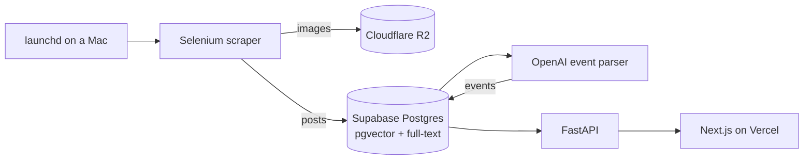

# Instinct

Club and event discovery for UC Irvine. Instinct scrapes club Instagram accounts and turns their posts into a searchable club directory and a campus events calendar.

Live: [instinct-2-0.vercel.app](https://instinct-2-0.vercel.app)

I built it solo, starting freshman year, because there was no single place to find out what clubs were doing.

## Numbers

- About 451 clubs, 19k scraped posts and 2.3k parsed events in production (Oct 2026)
- v1 reached over 3,000 page views and 200+ registered users
- About 200 clubs scraped per day

## How it works



- **Scraper** (`backend/src/instinct/tools`): launchd runs `daily_scrape` four times a day on my Mac. Each run takes the clubs scraped longest ago, scrapes them on one browser session and one login, opens only the newest 3 posts it hasn't seen, and stops for the rest of the day at 200 clubs or on any challenge, checkpoint or rate-limit page.
- **Storage**: post images go to Cloudflare R2 through the plain S3 API, so the provider is one endpoint URL.
- **Parsing**: OpenAI structured outputs turn emoji-heavy captions into events with dates, times and locations. Posts that fail to parse stay unparsed instead of saving bad data.
- **Data**: Supabase Postgres, with a generated `tsvector` for club search and pgvector embeddings. Schema lives in `supabase/migrations`.
- **API and web**: FastAPI serves clubs, posts and a date-range `/events` endpoint; the Next.js frontend renders club profiles and a month/week/day/list calendar.

## Interesting problems

- **Not getting banned.** The old rotation loop started a fresh browser and login for every club and fell back to a second account on failure. To Instagram that looks like repeated logins, which is what gets accounts flagged. I moved to one shared session per run and made challenge and checkpoint pages a hard stop instead of a rate limit to retry around.
- **Scraping on a budget.** A daily cap plus an oldest-first queue keeps every club fresh without spiking traffic. A club with no new posts costs one profile load, and a broken club moves to the back of the line instead of blocking it.
- **Making the LLM parser measurable.** Captions are messy, so I wrote `eval_event_parser` to compare prompts and models on real posts before changing the default.
- **Getting off Azure.** v3 ran on Azure Container Apps until an overprovisioned instance burned through the credits. The current setup keeps the database intact and moves the expensive Selenium work onto a machine I already own.
- **GCS to R2.** I moved images to R2 for zero egress fees and nulled the database paths that pointed into the deleted GCS bucket so the frontend falls back cleanly.

## Version history

- **v0**: a Python Selenium script writing local JSON files.
- **v1**: Next.js and FastAPI on Heroku. 3,000+ page views and 200+ users, then shelved.
- **v2**: rebuilt on Supabase Postgres with a Redis priority queue and a Discord bot dashboard.
- **v3**: containerized on Azure Container Apps with GitHub Actions CI/CD, until the credits ran out.
- **Now**: a cheap stack: local scraper, R2, Supabase and Vercel, with a redesigned calendar and club pages.

## Running locally

```bash
cp backend/.env.example backend/.env && cp frontend/.env.example frontend/.env.local
make install     # uv + bun dependencies
make db-local    # throwaway Postgres with migrations and seed data
make up          # Redis + API at localhost:8000/docs
make dev-web     # Next.js dev server
```

`make help` lists everything else. `make db-local` never touches the live Supabase project.

**Stack:** Python, FastAPI, Selenium, OpenAI, Supabase Postgres (pgvector), Redis, Cloudflare R2, Next.js, Tailwind, Vercel.

Questions: spallamr@uci.edu

_Instinct is not affiliated with or endorsed by the University of California, Irvine._
